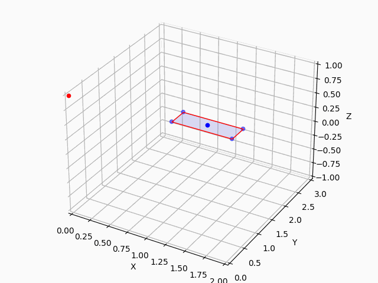

Results of simulation are represented below. In the first simulation the robust control with the use of quadratic programming tools was implemented. Second simulation is quaternion based PD control.

## Animation of a planar drone

## Animation of 3D object

